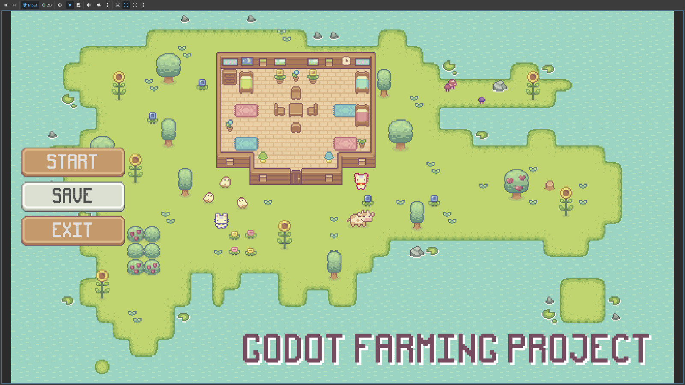

# Farming Game in Godot - Guided Project

A 2D top-down farming game built in **Godot**.

This project was created by following and implementing concepts from the tutorial [Rapid Vectors — How to Build a Complete 2D Farming Game]([https://www.youtube.com/watch?v=it0lsREGdmc](https://youtu.be/it0lsREGdmc?si=LdrvoQ1ujXcejZif)) by Rapid Vectors. The project covers a range of concepts including tilemap-based world building, reusable components, player state machines, farming interactions, NPC navigation, inventory, day/night cycles, save/load functionality, dialogue, and UI.

## Project overview

The game is a small farming simulation prototype where the player can move around the map, interact with the environment, gather resources, farm crops, manage items, and engage with simple world systems.

My goal with this project was not only to complete a tutorial, but to understand how a full playable game is assembled from interconnected systems inside Godot.

## What this project demonstrates

- Building a 2D game in **Godot**
- Working with **tilemaps** and layered environments
- Implementing **player movement** and a **state-based interaction system**
- Creating interactive objects such as:
  - trees
  - rocks
  - crops
  - chests
- Using **NPC navigation**
- Building gameplay UI such as:
  - tool panel
  - inventory
  - main menu
- Implementing **save and load**
- Structuring reusable scenes and components
- Combining gameplay systems into a complete playable level
- Using **test scenes** to validate that each of the mechanics and game logics works well.

## Repository structure

- `assets/` — art, visuals, and other imported game resources
- `dialogue/` — dialogue-related resources and conversation content
- `scenes/` — scripts that support running the main game scenes, organised by feature or function
- `scripts/` — Global and state machine scripts

## Why I built this

I built this project to move beyond theory and develop practical experience with:

- Godot workflows
- gameplay programming in GDScript
- scene composition
- reusable systems
- UI integration
- debugging and iteration

It also helped me understand how individual mechanics come together to form a cohesive player experience.

